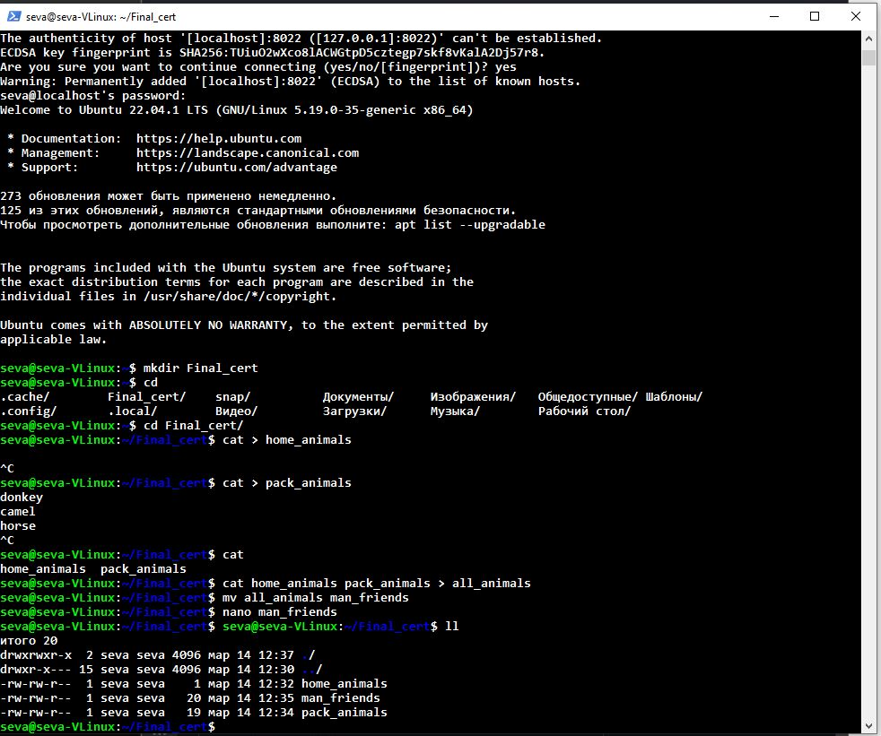
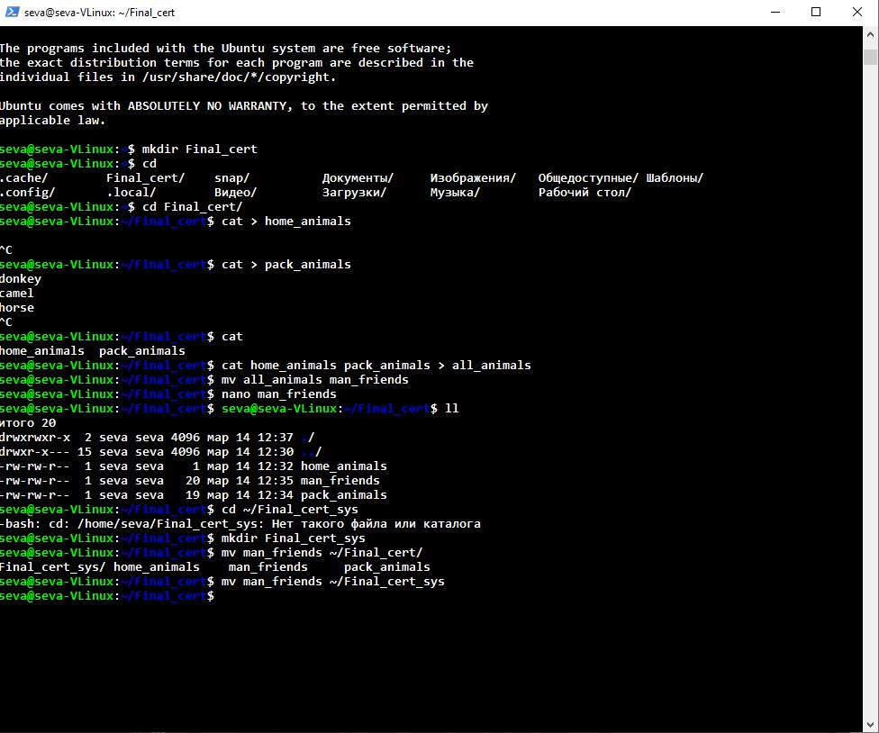
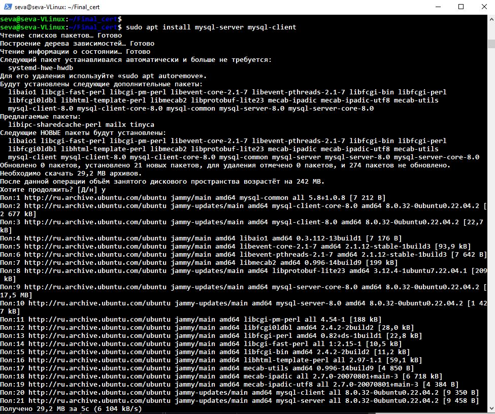
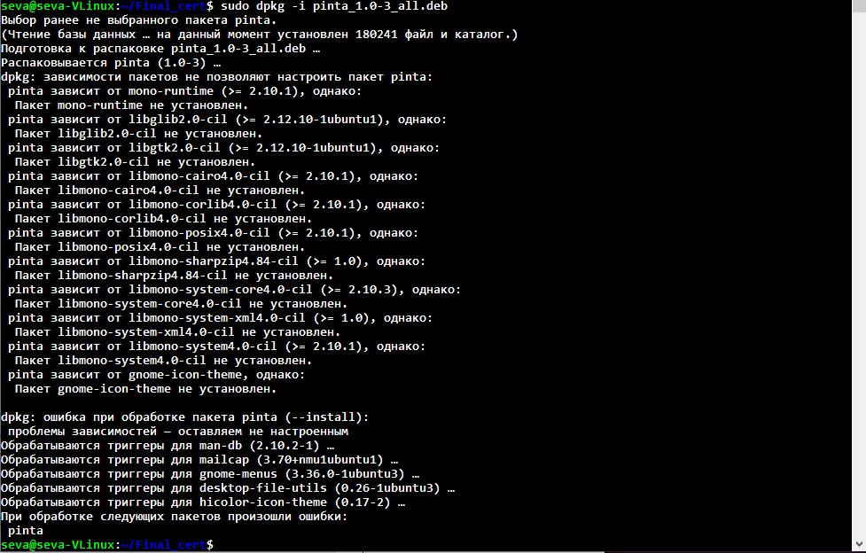
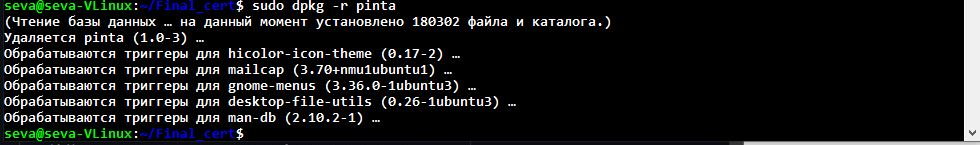
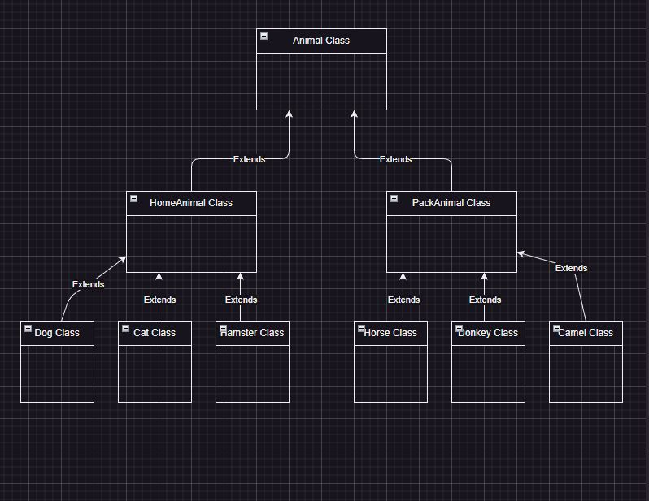

# Итоговая аттестация
## Информация о проекте
Необходимо организовать систему учета для питомника, в котором живут
домашние и вьючные животные.
Как сдавать проект
Для сдачи проекта необходимо создать отдельный общедоступный
репозиторий(Github, gitlub, или Bitbucket). Разработку вести в этом
репозитории, использовать пул реквесты на изменения. Программа должна
запускаться и работать, ошибок при выполнении программы быть не должно.
Программа, может использоваться в различных системах, поэтому необходимо
разработать класс в виде конструктора
## Задание
1. Используя команду cat в терминале операционной системы Linux, создать
два файла Домашние животные (заполнив файл собаками, кошками,
хомяками) и Вьючные животными заполнив файл Лошадьми, верблюдами и
ослы), а затем объединить их. Просмотреть содержимое созданного файла.
Переименовать файл, дав ему новое имя (Друзья человека).

2. Создать директорию, переместить файл туда.

3. Подключить дополнительный репозиторий MySQL. Установить любой пакет из этого репозитория.

4. Установить и удалить deb-пакет с помощью dpkg.


5. Выложить [историю команд в терминале ubuntu](https://github.com/PEBU3OP1/Final_certification/blob/main/Comands_historu.md)

6. Нарисовать диаграмму, в которой есть класс родительский класс, домашние
животные и вьючные животные, в составы которых в случае домашних
животных войдут классы: собаки, кошки, хомяки, а в класс вьючные животные
войдут: Лошади, верблюды и ослы).

7. В подключенном MySQL репозитории создать базу данных “Друзья
человека”<br>
```sql
    CREATE SCHEMA `human_friends` ;
```
8. Создать таблицы с иерархией из диаграммы в БД


```sql
USE human_friends;
CREATE TABLE animal_classes
(
	Id INT AUTO_INCREMENT PRIMARY KEY, 
	Class_name VARCHAR(30)
);

INSERT INTO animal_classes (Class_name)
VALUES ('pack'),
('home'); 


INSERT INTO pack_animals (pack_type_name, Class_id)
VALUES ('Camel', 1),
('Horse', 1),
('Donkey', 1);

CREATE TABLE home_animals
(
	  Id INT AUTO_INCREMENT PRIMARY KEY,
    home_type_name VARCHAR (30),
    Class_id INT,
    FOREIGN KEY (Class_id) REFERENCES animal_classes (Id) ON DELETE CASCADE ON UPDATE CASCADE
);

INSERT INTO home_animals (home_type_name, Class_id)
VALUES ('Hamster', 2),
('Cat', 2),  
('Dog', 2); 


```
## 9. Заполнить низкоуровневые таблицы именами(животных), командами, которые они выполняют и датами рождения
### Home_animals

```sql
CREATE TABLE hamster 
( Id INT AUTO_INCREMENT PRIMARY KEY,
hamster_name VARCHAR (30),
hamster_comand VARCHAR (30),
hamster_birthday DATE,
home_type_id INT,
FOREIGN KEY (home_type_id) REFERENCES home_animals (Id) ON DELETE CASCADE ON UPDATE CASCADE
);
INSERT INTO hamster (hamster_name, hamster_comand, hamster_birthday, home_type_id)
VALUES 
('Яша','home', '2000-05-12', 1),  
('Паша','go away', '2011-07-11', 1), 
('Хомяк_1','', '2010-02-10', 1);

CREATE TABLE cat
( Id INT AUTO_INCREMENT PRIMARY KEY,
cat_name VARCHAR (30),
cat_comand VARCHAR (30),
cat_birthday DATE,
home_type_id INT,
FOREIGN KEY (home_type_id) REFERENCES home_animals (Id) ON DELETE CASCADE ON UPDATE CASCADE
);

INSERT INTO cat (cat_name, cat_comand, cat_birthday, home_type_id)
VALUES ('Кися', 'к ноге', '1900-01-01', 2),
('Пися', 'к барьеру', '1900-02-02', 2),  
('Дымка', '', "1950-02-02", 2); 

CREATE TABLE dog 
( Id INT AUTO_INCREMENT PRIMARY KEY,
dog_name VARCHAR (30),
dog_comand VARCHAR (30),
dog_birthday DATE,
home_type_id INT,
FOREIGN KEY (home_type_id) REFERENCES home_animals (Id) ON DELETE CASCADE ON UPDATE CASCADE
);

INSERT INTO dog (dog_name, dog_comand, dog_birthday, home_type_id)
VALUES ('Дружок', 'гулять', '1950-11-11', 3),
('Вражок', 'сидеть', "1951-11-11", 3),  
('Пирожок', 'стоять', "1952-11-11", 3);
```

Pack_animals
```sql
CREATE TABLE camel
( Id INT AUTO_INCREMENT PRIMARY KEY,
camel_name VARCHAR (30),
camel_comand VARCHAR (30),
camel_birthday DATE,
home_type_id INT,
FOREIGN KEY (home_type_id) REFERENCES pack_animals (id) ON DELETE CASCADE ON UPDATE CASCADE
);

INSERT INTO camel (camel_name, camel_comand, camel_birthday, home_type_id)
VALUES ('Алексей','ищи оазис', '1918-04-02', 1),
('Дмитрий Петрович','ищи группу оазис', '1918-03-02', 1),  
('Гора','уйди от меня', '1918-11-02', 1);

CREATE TABLE horse
( Id INT AUTO_INCREMENT PRIMARY KEY,
horse_name VARCHAR (30),
horse_comand VARCHAR (30),
horse_birthday DATE,
home_type_id INT,
FOREIGN KEY (home_type_id) REFERENCES pack_animals (id) ON DELETE CASCADE ON UPDATE CASCADE
);

INSERT INTO horse (horse_name, horse_comand, horse_birthday, home_type_id)
VALUES ('Лошадь','оазис', '1911-04-02', 2),
('Лошадка','ищи', '1911-03-02', 2),  
('Лошаденка','уйди', '1911-11-02', 2);


CREATE TABLE donkey
( Id INT AUTO_INCREMENT PRIMARY KEY,
donkey_name VARCHAR (30),
donkey_comand VARCHAR (30),
donkey_birthday DATE,
home_type_id INT,
FOREIGN KEY (home_type_id) REFERENCES pack_animals (id) ON DELETE CASCADE ON UPDATE CASCADE
);

INSERT INTO donkey (donkey_name, donkey_comand, donkey_birthday, home_type_id)
VALUES ('Осел','', '1909-04-02', 3),
('Ослище','ищи ослиху', '1909-03-02', 3),  
('Ослик','приди', '1909-11-02', 3);
```
10. Удалив из таблицы верблюдов, т.к. верблюдов решили перевезти в другой питомник на зимовку. Объединить таблицы лошади, и ослы в одну таблицу.

```sql
SET SQL_SAFE_UPDATES = 0;
DELETE FROM camel;


SELECT horse_name as name, horse_comand as command, horse_birthday as bday FROM horse
UNION SELECT  donkey_name, donkey_comand, donkey_birthday FROM donkey;
```
11. Создать новую таблицу “молодые животные” в которую попадут все
животные старше 1 года, но младше 3 лет и в отдельном столбце с точностью до месяца подсчитать возраст животных в новой таблице


```sql
CREATE TABLE young_animal AS
SELECT *,TIMESTAMPDIFF(YEAR, bday, CURDATE())  as Bday_IN_years, TIMESTAMPDIFF(MONTH, bday, CURDATE())%12  as Bday_IN_month FROM animal
WHERE TIMESTAMPDIFF(YEAR, bday, CURDATE()) BETWEEN 0 AND 115;
```
12. Объединить все таблицы в одну, при этом сохраняя поля, указывающие на прошлую принадлежность к старым таблицам.

```sql
SELECT h.horse_name, h.horse_comand, h.horse_birthday, pa.pack_type_name, yo.Bday_IN_years 
FROM horse h
LEFT JOIN pack_animals pa ON pa.Id = h.home_type_id
LEFT JOIN young_animal yo ON yo.Name = h.horse_name

UNION
SELECT d.donkey_name, d.donkey_comand, d.donkey_birthday, pa.pack_type_name, yo.Bday_IN_years 
FROM donkey d
LEFT JOIN pack_animals pa ON pa.Id = d.home_type_id
LEFT JOIN young_animal yo ON yo.Name = d.donkey_name

UNION
SELECT c.cat_name, c.cat_comand, c.cat_birthday, ho.home_type_name, yo.Bday_IN_years 
FROM cat c
LEFT JOIN home_animals ho ON ho.Id = c.home_type_id
LEFT JOIN young_animal yo ON yo.Name = c.cat_name

UNION
SELECT d.dog_name, d.dog_comand, d.dog_birthday, ho.home_type_name, yo.Bday_IN_years 
FROM dog d
LEFT JOIN home_animals ho ON ho.Id = d.home_type_id
LEFT JOIN young_animal yo ON yo.Name = d.dog_name

UNION
SELECT ha.hamster_name, ha.hamster_comand, ha.hamster_birthday, ho.home_type_name, yo.Bday_IN_years 
FROM hamster ha
LEFT JOIN home_animals ho ON ho.Id = ha.home_type_id
LEFT JOIN young_animal yo ON yo.Name = ha.hamster_name
```
13. Создать класс с Инкапсуляцией методов и наследованием по диаграмме.
14. Написать программу, имитирующую работу реестра домашних животных.
В программе должен быть реализован следующий функционал:<br>
14.1 Завести новое животное<br>
14.2 определять животное в правильный класс<br>
14.3 увидеть список команд, которое выполняет животное<br>
14.4 обучить животное новым командам<br>
14.5 Реализовать навигацию по меню<br>
15. Создайте класс Счетчик, у которого есть метод add(), увеличивающий̆
значение внутренней̆ int переменной̆ на 1 при нажатии “Завести новое
животное” Сделайте так, чтобы с объектом такого типа можно было работать в
блоке try-with-resources. Нужно бросить исключение, если работа с объектом
типа счетчик была не в ресурсном try и/или ресурс остался открыт. Значение
считать в ресурсе try, если при заведении животного заполнены все поля